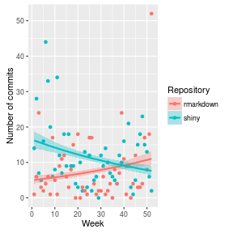

## 1. Introduction

  - RGithubTrends is an application to visualize R github repositories trends.
  - User can compare different trends for the **top 20** starred repositories.

---

## 2. Design

  - For the top 20 starred repositories, the weekly activity in the past year (52 weeks) is obtained with the github API.
  - A generalized linear model is fit for each repository.
  - A plot is show to compare the trends visually.

---

## 3. Example

  - An example of the model fitting algorithm:

```r
library(ggplot2)
GitData <- read.csv('GitData.csv')
ggplot(GitData[GitData$Repo == 'rmarkdown' | GitData$Repo == 'shiny',],
        aes(Week, value, group=Repository, colour=Repository)) + geom_point() +
    stat_smooth(aes(fill=Repository), method='glm',
        method.args=list(family=poisson(link='log')), alpha=0.3) +
    ylab('Number of commits')
```



---

## 4. Conclusion

  - Some of the top starred R repositories are no longer maintained.
  - ggplot2 is very actively maintained.
  - Goto the [demo](http://apruden.shinyapps.io/RGithubTrends/).


